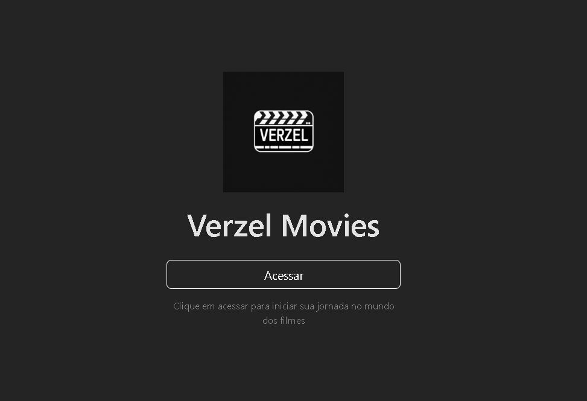
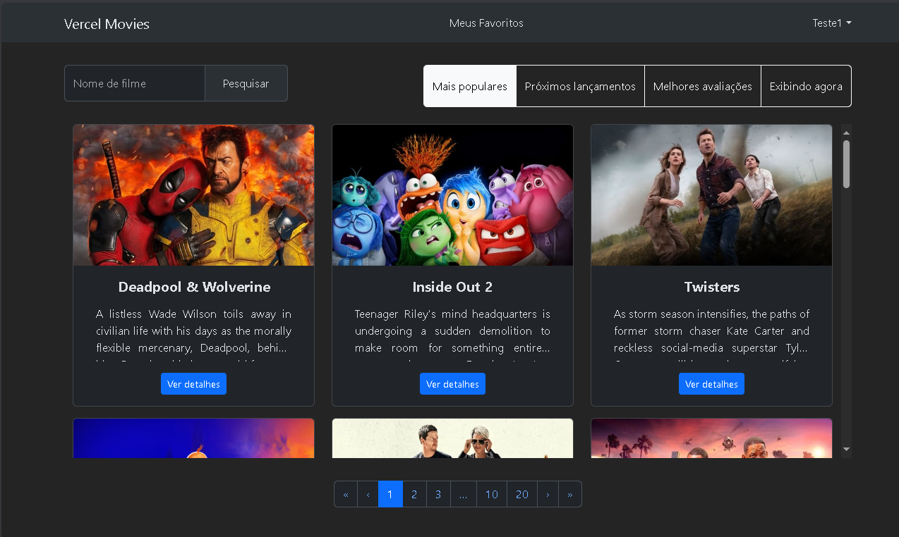
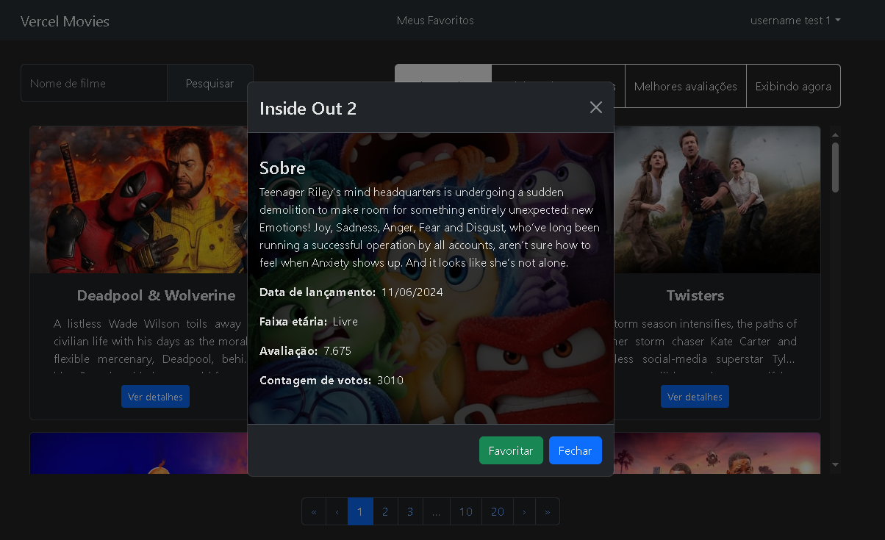
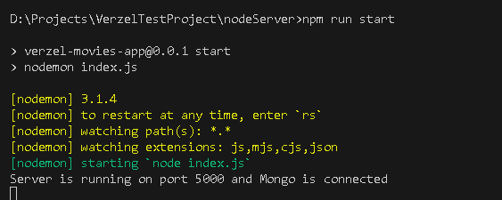
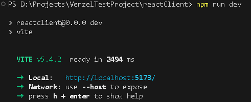
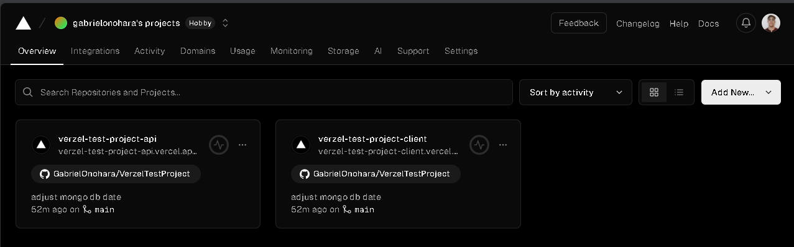

# Verzel Movies
Este [site](https://verzel-test-project-client.vercel.app/) é um projeto full-stack no qual o usuário pode pesquisar e explorar filmes, além de poder salvar os seus preferidos em uma lista de favoritos.




## Estrutura do Projeto
- **API Externa:** Api completa de filmes do  [TMDB](https://www.themoviedb.org/)
- **Frontend**: Criado com [Vite](https://vitejs.dev/) e [React](https://react.dev/blog/2023/03/16/introducing-react-dev)
- **Backend**: Criado com [Express](https://expressjs.com/pt-br/) 
- **Banco de Dados**: Utilizado o [MongoDB](https://www.mongodb.com/)
- **Deploy**: Site foi hosperado na [Vercel](https://vercel.com/)

## Funcionalidades
Este projeto possui as funcionalidades essenciais como:
 - Sistema de autentificação JWT
 - Sitema de busca de filmes
 - 4 tipos de buscas rápidas fornecidas pelo API do TMDB
 - Salvar os filmes favoritos em uma lista de favoritos
 - Gerar link de compartilhamento da sua própria lista de filmes

## Requisitos
Para rodar localmente o sistema é necessário ter 2 componentes principais
- Node.js & npm
- MongoDB (Pode ser tanto um cluster remoto como MongoDB Atlas como instalar o serciço localmente e usar uma conexão localhost)

### Backend
Para rodar a aplicação servidor siga os seguintes passos:
1. Navegue até a pasta do backend e instale as dependências:
    ```bash
    cd nodeServer:
    npm install ou npm i
    ```
2. Crie um arquivo .env com as variáveis utilizadas
    ```bash
    PORT=<Porta que a aplicação vai rodar>
    TMDB_URL=https://api.themoviedb.org/3
    TMDB_TOKEN=<TOKEN de autentificaçã do TMDB gerado após a criação de conta>
    MONGO_URI=<URL do banco de dados, se for local ex:(mongodb://localhost:27017/verzelmovies)>
    JWT_SECRET=<Uma chave padrão utilizada para tokens JWT(ex: RANDOMJWTSECRET)>
   ```
3. Execute o script de comando adicionado ao package.json
    ```bash
    npm run start
    ```
Ao final deste processo, haverá uma mensagem mostrando que aplicação foi iniciada e que a conexão com o banco de dados foi realizada:


### Frontend
Para rodar a aplicação cliente siga os seguintes passos:
1. Navegue até a pasta do frontend e instale as dependências:
   ```bash
   cd reactClient:
   npm install ou npm i
   ```
2. Crie um arquivo .env com a URL da aplicação servidor
   ```bash
   VITE_APP_API_URL=http://localhost:5000
   ```
3. Execute o script de comando de inicialização do próprio Vite:
   ```bash
   npm run dev
   ```
Ao final deste processo o vite apontará no CMD a mensagem da porta que a aplicação está rodando:



### Deploy
O deploy deste projeto foi feito na Vercel. A própria plataforma já contém diversa opções pré-definidas de frameworks para publicação.

Além disso, a conexão com o GitHub deixa tudo mais simples, pois após o deploy cada push para a branch principal já inicializa um novo processo de build automático que em instantes já gera as mudanças da aplicação hospedada.

Nos dois projetos, é possível visualizar os JSONs de configuração vercel.json. Como eu deixei a mesma pasta no mesmo projeto Github, a cada atualização tanto backend como frontend são atualizadas pelo mesmo git push.
No painel da Vercel os projetos ficam listados assim:




